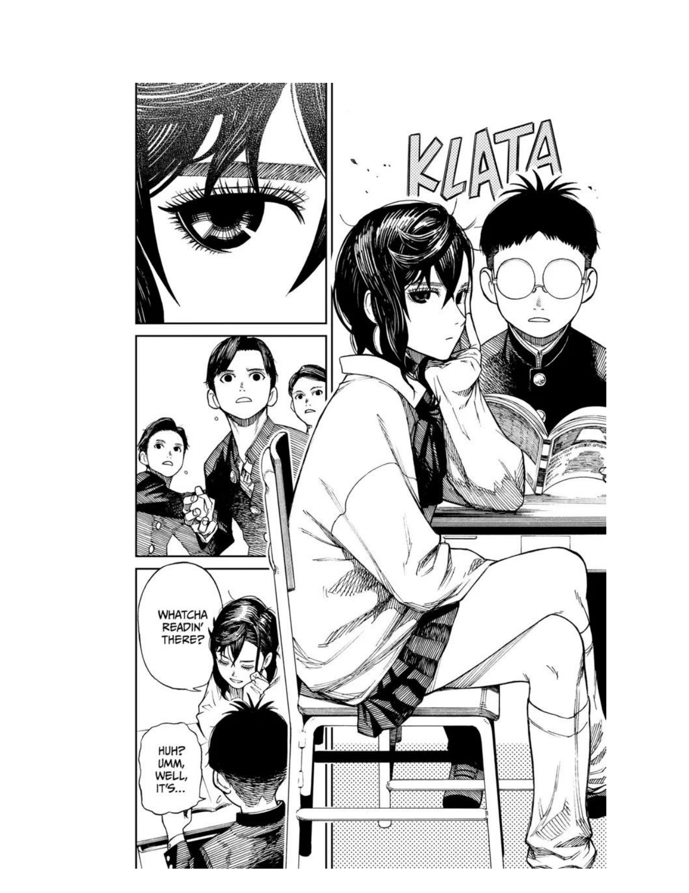
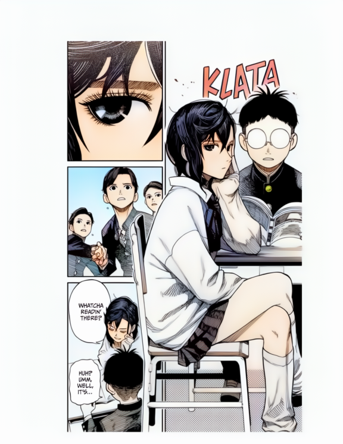

| Before | After |

<table>
  <tr>
    <td></td>
    <td></td>
  </tr>
</table>

# Manga-Colorizer
Introducing Manga-Colorizer, a tool that brings your mangas to life.

## New Features:
- [x] Now works seamlessly on any website.
- [x] Blazingly fast image colorization on the fly.
- [x] Intelligent and dynamic colorization.
- [x] Super-resolution upscaling for enhanced image quality.
- [x] Additional settings for more customization options.
- [x] Organized caching into a dedicated folder for reuse.
- [x] Options to display original, colorized version, or both.
- [x] Force colorization. 

## Local Usage: 
0. Local hosting is recommended if you have access to a cuda GPU.
1. Clone or download this repository as .zip and extract. 
2. Download the <a href="https://drive.google.com/file/d/1qmxUEKADkEM4iYLp1fpPLLKnfZ6tcF-t/view?usp=sharing" rel="nofollow">Generator</a> weights and move it to <code>Backend/networks</code> folder.
3. Install <a href="https://www.python.org/downloads/">python</a> and setup <a href="https://pytorch.org/get-started/locally/">pytorch</a> if not already done.
4. In the Backend folder, open a command prompt, and run:
   - For installing necessary modules: <code>pip install -r requirements.txt</code>
   - For starting the server: <code>python app-stream.py</code>
   - Backend should be running on localhost (https://127.0.0.1:5000) and Private IP (https://x.x.x.x:5000)
5. Next, follow any of the 'Client Usage Instructions'.

## Client Usage Instructions | PC | Firefox: 
0. Open the server URL:
   - Use localhost (local-hosting) (https://127.0.0.1:5000) or,
1. Open the firefox <a href="about:debugging#/runtime/this-firefox">debugging</a> page and click 'Load Temporary Add-on'.
2. Navigate to the Frontend-Firefox directory and choose manifest.json.
3. If the extension loads correctly, you will see it's settings page.
4. Paste the server URL, in the extension's 'API URL' field and press 'Test'.
5. If you see 'Manga Colorizer is Up and Running!', then its working!
6. Close all these necessary tabs now and open a black-and-white manga.
7. Open the Extensions menu (looks like a puzzle piece).
8. Then right-click 'Manga Colorizer' and select 'Always allow on ...' also 'Pin to Toolbar'
9. Click on the 'Manga Colorizer' extension to open its settings as a popup.
10. Click the 'Colorize' button, that should appear next to 'Next chapter'.
11. Press the 'Add ...' button to add the site to the list of Manga Sites, so it automatically colors images from now on.
12. Press 'Colorize!' and enjoy!.
13. These steps have to be repeated everytime firefox is started.

## Client Usage Instructions | PC | Chrome/Brave/Any-Chromium: 
0. Open the server URL:
   - Use localhost (local-hosting) (https://127.0.0.1:5000) 
1. Goto <code>chrome://extensions/</code> webpage, turn on developer mode, and click 'Load Unpacked'.
2. Navigate to and select Frontend-Chrome folder. Manga Colorizer settings should open in a new tab.
3. Paste the server URL, in the extension's 'API URL' field and press 'Test'.
4. If you see 'Manga Colorizer is Up and Running!', then its working!
5. Close all these necessary tabs now and open a black-and-white manga.
6. Open the Extensions menu (looks like a puzzle piece) and click the pin next to 'Manga Colorizer'.
7. Click on the 'Manga Colorizer' extension to open its settings as a popup.
8. Press the 'Add ...' button to add the site to the list of Manga Sites, so it automatically colors images from now on.
9. Press 'Colorize!' and enjoy!.

